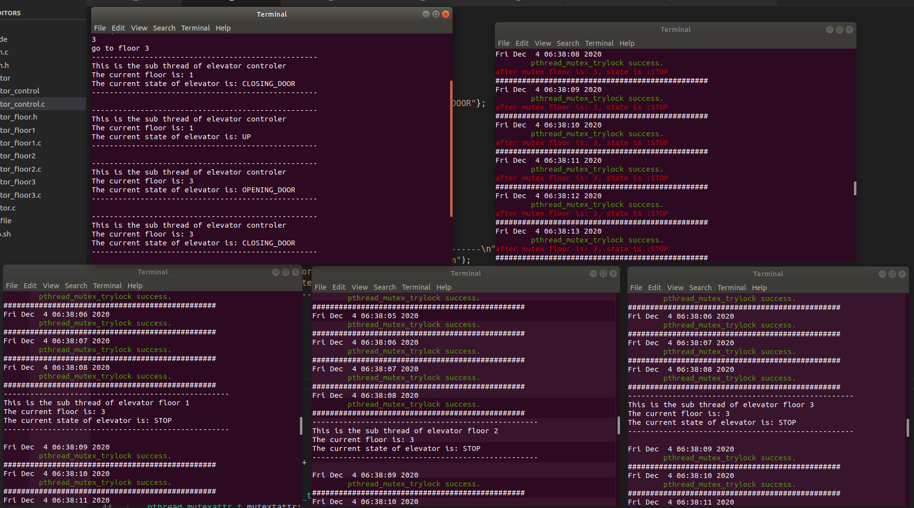

# OSLAB 2 

#### 吴泓宇 181250155
## 实验要求

电梯模拟程序

实验任务：在 Linux 上编写程序，模拟一个三层楼房中的电梯运行。要求：

1.    该程序运行后由 5 个进程组成，分别模拟 1 楼、2 楼、3 楼的控制面板，电梯内的控制面板，以及电梯本身；

2.    每一楼层的控制面板进程由 2 个线程组成:线程 1 显示电梯的运行情况（所处楼层，运动方向等）；线程 2 接受用户的指令（按向上或者向下键）；

3.    电梯内的控制面板进程也由两个线程组成：线程 1 显示电梯的运行情况，线程 2 接受用户的按键（开门、关门、 目的楼层）；

4.    电梯进程在上升、下降、停止、开门及关门这几个事件中循环；

5.    可以按照自己对电梯运行的理解合理调整上述需求；

6.    模拟程序应尽量多使用课程所学的进程间（线程间）通信、同步技术；

7.    图形界面或者控制台皆可。

## 架构设计

项目目录结构如下：

各个模块的功能如下：

- `comm.c/h`: 封装共享内存的相关接口
- `elevator.c`: 电梯，只有显示状态作用
- `elevator_control.c`: 电梯内的控制台，一切指令的最终执行者，包含两个线程，一个显示电梯状态，一个接受开关门、目的楼层指令
- `elevator_floor1/2/3.c`: 各个楼层的控制台，包含两个线程，一个显示电梯状态，一个接受上下楼指令
- `elevator_floor.h`: 声明一些全局变量
- `Makefile`: makefile文件
- `setup.sh`：程序入口

## 核心功能实现

### 多线程

采用了pthread线程库

### 进程间通信和同步

我采用了共享内存+互斥锁的方式，由elevator_control开辟一块共享内存空间，划分为六块区域，分别存放电梯当前楼层，电梯当前状态，1、2、3楼的信号，以及一把公共的mutex锁。

将mutex锁放在共享内存中的方式使得它由线程锁“进化”为一把进程锁。

共享内存和互斥锁的代码实现：

共享内存可以用来同步，可是如何让线程自动地去访问共享内存呢？在这里我借助了C库中的signal模块，用setitimer来定时发送一个时钟信号，这个信号会激活进程执行相应的函数。如下图为elevator_control的信号激活函数：

这是elevator_control的子线程,它会不断检查全局的floor_num与上一次检查的floor_num的差异，若时钟信号同步后全局变量被修改，它就会将新的状态打印出来。
其他进程中的状态打印也类似。

## 运行截图

运行setup，自动打开5个bash并分别运行5个进程

可以看到，进程之间已经在不断获取互斥锁来同步电梯的状态

在controler上按键，比如当前楼层为1，去3楼：

子线程开始模拟，并打印出电梯状态的改变，同时，其余各个进程也通过同步的方式捕捉到了状态改变，并作相应显示，在这里的一个问题是，control进程可以打印电梯完整的状态变化链，而其他进程只能捕捉到其中一个状态，这应该是时钟同步更新周期造成的。这里是1秒，但是，如果时间同步周期设置太短，又会直接导致没有东西打印出来...原因推测是主线程占用CPU太多导致子线程无法获得CPU资源？

若此时在一个楼层（如一楼）的控制台输入u(即up)，表示该层用户要上楼，则电梯则会从三楼下来：

这个操作涉及了其他进程对共享内存的读和写，要频繁访问互斥锁，因此可以发现其他各个进程都出现了互斥锁获取失败的情况，在读写完成后又恢复正常。说明互斥锁正常工作。

## 心得 
本次实验中实现的电梯调度逻辑较为简单，主要是在设计共享内存和互斥锁上花了功夫，网上很多资料都说pthread_mutex无法用于跨进程的场合，但经过实践我还是实现了。这是我第一次实现多进程多线程的编程，踩了很多的坑，各种库函数的用法都是从零学起，但最后还是实现了比较完备的功能，成就感还是很大的。